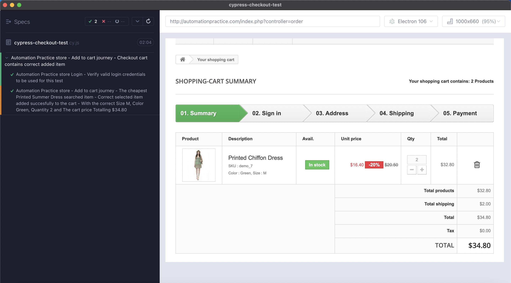
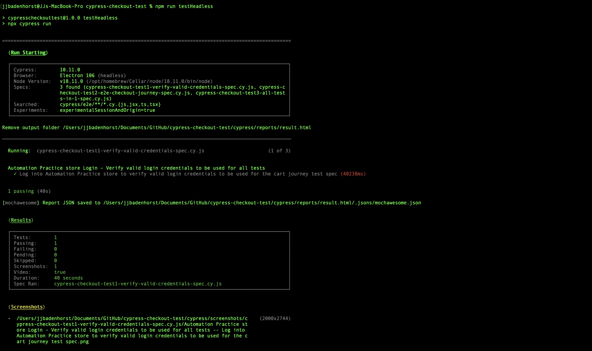
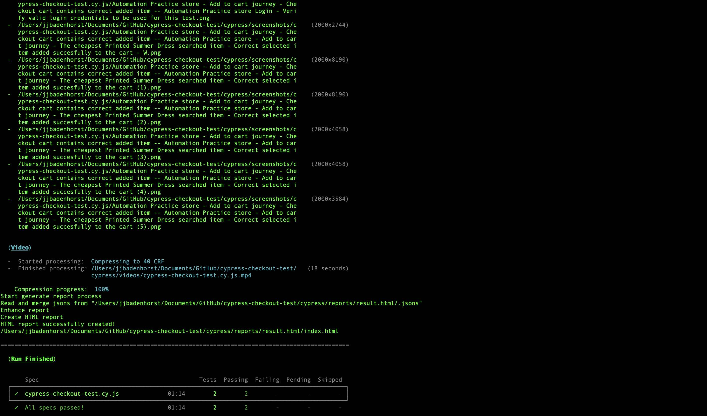
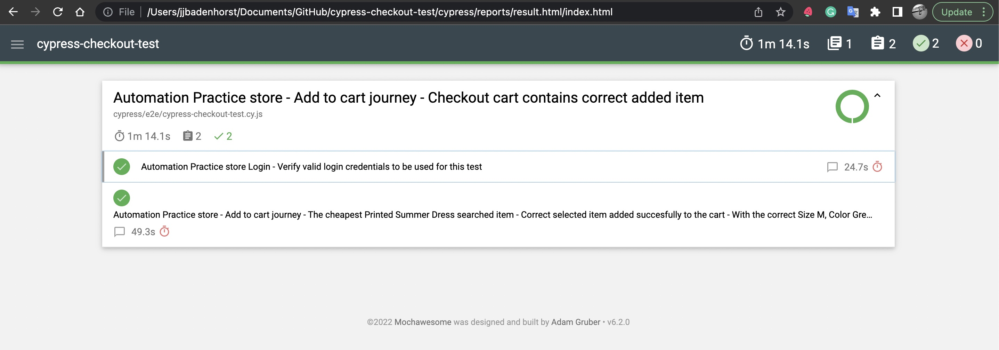

# E-commerce Checkout Test with [Cypress.io](https://www.cypress.io/)
This repo contains Cypress tests for login and cart checkout assertions with the ["Automation practice"](http://automationpractice.com/) e-commerce store to showcase the Cypress Test Framework.

## Project information
### This project contains two Cypress tests:
1. Log in check for *Automation Practice* e-commerce store *(Sanity run to verify valid login credentials to be used for test 2)*.
2. Log in to the Automation Practice e-commerce store:
- Search for the item *"Printed Summer Dress"*
- Select the *cheapest dress*
- Change the *quantity from 1 to 2*
- Change the *size from S to M*
- Change the *colour from Yellow to Green*
- Add the *item to the cart*
- Proceed to the *checkout cart page*
- Assert *checkout cart page* for the *correct item: "Printed Chiffon Dress", size: "M", colour: "Green", quantity: "2" and cart price total equals: "$34.80"*.

### This project has Cypress configs and code to showcase:
- The use of *Fixtures* with test data support.
- The use of *Selectors* support.
- *Screen capture* support for all passed commands.
- *Mochawesome reporter* for test run reporting.
- Test run *Video with compression* support.
- *Failed test retry* support.

## Pre-requisites
1. [NodeJS installed](https://nodejs.org/en/download/).
2. [npm installed](https://docs.npmjs.com/downloading-and-installing-node-js-and-npm/).

## Setup
1. Clone this repository or download the zip and extract it.
2. Go to the *testdata* file: `cypress/fixtures/testdata.json`.
3. Enter your registered [*Automation practice*](http://automationpractice.com/) `email` and `password` in `testdata.json` and save the file.
4. Open your terminal to the root directory of the project *(cypress-checkout-test)* and run `npm install` command in the terminal/cli to install all dev dependencies.
5. Run `npm run {script option}` to execute the tests in the cli:
- `npm run testWithBrowser`: To run the tests headed *(with a browser)*.
- `npm run testHeadless`: To run the tests headless *(without a browser)*.
- `npm run testWithBrowserNoExit`: To run the tests headed and the Cypress runner will remain open after the test run completed *(Test run video will keep recording until Cypress runner is closed/killed!)*.
6. When the test run completed, a *test results report* will be generated in the `cypress/reports/result.html/index.html` path.

## Expected/Successful run samples

1. Successful Run - Cart checkout page in Cypress runner with Electron browser:



2. Successful Run - From Terminal/CLI with passed test results output:




3. Successful Run - Cypress Test Results from the HTML report with passed test results output:



4. Successful Run - Video recording with no failures *(no test retry)*

https://user-images.githubusercontent.com/3204581/200117517-c88fd926-c3e6-41ff-9659-280ca7d86cab.mp4

5. Successful Run - Video recording with *failed tests retried*

https://user-images.githubusercontent.com/3204581/200117566-cf129642-47a2-4929-9894-3f50873365fd.mp4

## Gotchas

1. `npm install` Node package install hangs *for about 5 mins* then gives `ECONNRESET network error`.

```js
Npm install : FetchError: request to http://registry.npmjs.org/... failed, reason: read ECONNRESET
```

### Troubleshooting to resolve the npmjs FetchError:
- Could be your internet connection: Hotspot/tether/connect to a reliable internet connection and re-run `npm install` to see if it still fails *or...*
- Add a host entry for registry.npmjs.org: `ping registry.npmjs.org` to obtain the IP address then update `/etc/hosts` with the IP address E.g. `104.16.20.35 registry.npmjs.org` and re-run `npm install` *or...*
- Run `npm config edit` and clear out the `.npmrc` file, save it and clean out the cache with `npm cache clean -f` then re-run `npm install` *or...*
- Could be a proxy issue in your network that needs to be resolved - [*reference npm config docs to configure proxy settings*](https://docs.npmjs.com/cli/v8/using-npm/config#proxy).

## Future work planned - *TODOs*

1. Using a cookie to emulate logged on session state.
2. Implement [cypress-image-compare pixel diff tests](https://www.npmjs.com/package/cypress-image-compare).
3. [Docker](https://www.docker.com/) containerisation to package the forked ["Automation practice"](http://automationpractice.com/) app into a container allowing Cypress tests to run in and against the local docker instance.
4. Cypress test kicked off/run with [Jenkins](https://www.jenkins.io/) or [Circle CI](https://circleci.com/).
5. Database integration to showcase test run setups and tear downs.
6. Create a [containerised workflow with docker and openshift](https://github.com/OBVIOCO/cypress-checkout-test/new/main?filename=.github%2Fworkflows%2Fopenshift.yml&workflow_template=deployments%2Fopenshift) Or [Azure](https://github.com/OBVIOCO/cypress-checkout-test/new/main?filename=.github%2Fworkflows%2Fazure-webapps-node.yml&workflow_template=deployments%2Fazure-webapps-node) or [Amazon ECS](https://github.com/OBVIOCO/cypress-checkout-test/new/main?filename=.github%2Fworkflows%2Faws.yml&workflow_template=deployments%2Faws).
7. [Improve Building the project in NodeJS with npm and grunt](https://github.com/OBVIOCO/cypress-checkout-test/new/main?filename=.github%2Fworkflows%2Fnpm-grunt.yml&workflow_template=ci%2Fnpm-grunt).

